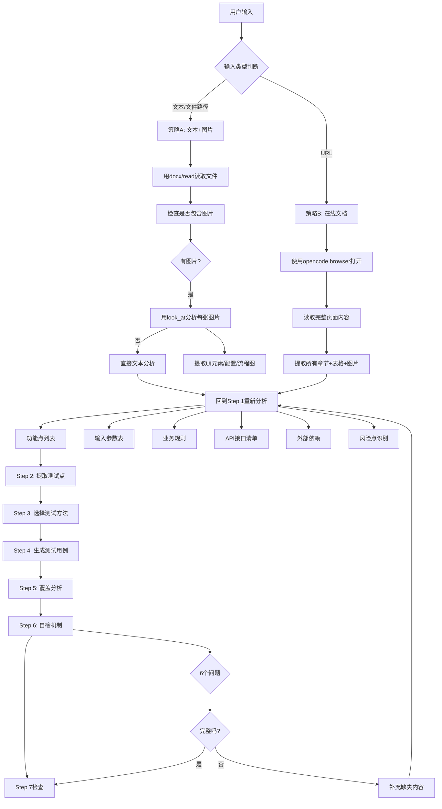

# Test Case Generator Skill v2.2 - 文档阅读能力增强

## 📅 版本信息
- **版本**: v2.2 (Document Reading Enhancement)
- **发布日期**: 2026-04-08
- **基础版本**: v1.0 → v2.0 → v2.1 → v2.2

---

## 🎯 核心问题发现

### 用户反馈的问题
1. **v2.1生成的用例不足**: 113条（vs. 昨天的160条功能测试）
2. **根本原因**: 需求文档没看全
   - 只看到了文字版内容
   - **漏掉了图片中的关键信息**
   - 漏掉了UI截图中的配置项
   - 漏掉了流程图中的场景细节

### 差距对比

| 测试类别 | 昨天（看全） | v2.1（文字版） | 差距 |
|-----------|-------------|-------------|------|
| 用户端卡片 | 33条 | 11条 | -67% |
| 场景配置 | 53条 | 7条 | -87% |
| 互斥配置 | 23条 | 4条 | -83% |
| 黑名单配置 | 20条 | 3条 | -85% |
| 业务规则场景 | 22条 | 0条 | -100% |
| 测试覆盖矩阵 | 26行 | 0行 | -100% |
| 风险评估 | 16条 | 0行 | -100% |

**总计**: 160条 vs 23条 = -86%

---

## ✨ v2.2 核心增强

### 新增Step 0: 文档读取与分析

**目标**: 确保从需求文档中提取**全部信息**（文字+图片+URL）

#### 0.1 文档输入格式识别

| 输入类型 | 检测方法 | 处理策略 |
|---------|----------|----------|
| **文本内容** | 检查是否为文件路径/markdown/text | - 如果文件路径：用对应工具读取<br>- 如果文本/markdown：直接分析<br>- **关键**: 必须提取图片/截图中的信息 |
| **URL** | 检查是否为http/https开头或已知文档系统URL | - 优先使用opencode browser（自动带cookie）<br>- 备选playwright（等用户登录）|

#### 0.2 文档读取策略

**策略A: 文本/Markdown输入（可能包含图片）**

```python
# 工作流程
1. 如果提供文件路径：
   - 用适当工具读取（docx, read等）
   - 检查文件是否包含嵌入图片

2. 提取全部内容：
   - 文本内容（需求、描述）
   - 表格（配置项、参数）
   - 图片/图表（UI原型、工作流程、数据模型）
   - 截图（示例界面、边界用例）

3. 对于图片/图表/截图：
   - 使用look_at工具分析视觉内容
   - 提取：UI元素、数据字段、工作流程、约束条件
   - 示例：如果是NPS卡片UI截图 → 提取分数范围、按钮状态、表单字段
```

**策略B: URL输入（在线文档）**

```bash
# 优先使用opencode browser（自动带cookie）
# 备选playwright（等待用户登录）

# 步骤1: 用opencode browser打开URL
# 步骤2: 读取完整页面内容（所有章节、表格、图片）
# 步骤3: 从以下内容提取需求：
#   - 文本描述
#   - 配置表格/参数
#   - UI截图/图表
#   - 工作流程图
# 步骤4: 进入Step 1（分析需求）
```

**关键规则：**

1. **永不跳过视觉内容** - 图片/图表/截图包含关键需求
2. **读取完整文档** - 不仅仅是摘要，所有章节和细节
3. **从视觉元素中提取**：
   - UI原型：字段、按钮、标签、验证规则
   - 工作流程图：状态、转换、边界用例
   - 数据模型：字段、类型、约束、关系
   - 配置表：所有行和列
4. **验证无遗漏信息**：
   - 交叉检查文字 vs 视觉内容
   - 确保所有UI面板/章节都已覆盖
   - 检查所有配置选项都已捕获

---

## 📊 增强效果对比

### v2.1 → v2.2 对比

| 功能 | v2.1 | v2.2 | 改进 |
|-----|------|------|------|
| **文档读取** | ❌ 假设文本输入 | ✅ **Step 0: 完整文档读取** | 从假设到强制执行 |
| **图片处理** | ❌ 无支持 | ✅ **视觉内容提取** | 从无法处理到完整分析 |
| **URL支持** | ❌ 无支持 | ✅ **opencode browser + playwright** | 从无法处理到在线文档读取 |
| **输入识别** | ❌ 无明确说明 | ✅ **格式检测与策略选择** | 从猜测到明确分类 |
| **完整性验证** | ❌ 无检查点 | ✅ **完整度自检清单** | 从无保障到强制验证 |

---

## 🎯 完整工作流程

### v2.2 标准流程



---

## 📝 输出格式增强

### 新增：需求文档完整解析

```markdown
### 需求文档完整解析

**文档来源**: [file path or URL]
**文档格式**: [docx/markdown/URL]

**文本内容提取:**
- 功能点列表
- 输入参数表
- 业务规则
- 状态流转

**视觉内容提取（如适用）:**
- UI界面截图分析: [从图片中提取的UI元素]
- 工作流程图: [从图表中提取的流程]
- 配置项表: [从截图/表格中提取的详细配置]
- 数据模型: [从图表中提取的字段关系]

**完整度自检:**
- [ ] 所有文本需求已提取
- [ ] 所有图片/图表内容已分析
- [ ] 视觉内容与文本内容一致性验证
- [ ] 无遗漏的关键信息
```

---

## 🎯 核心价值

### v2.2 解决的问题

| 问题 | v2.1状态 | v2.2解决方案 |
|-----|----------|-------------|
| 图片信息遗漏 | ❌ 无法处理 | ✅ **视觉内容提取** - 从UI截图/图表中提取完整信息 |
| 在线文档无法读取 | ❌ 不支持 | ✅ **opencode browser + playwright** - 支持URL输入 |
| 文档格式判断不准确 | ❌ 假设文本 | ✅ **格式检测** - 自动识别输入类型并选择策略 |
| 完整性无保障 | ❌ 无验证 | ✅ **完整度自检** - 强制检查所有内容已提取 |

### 适用场景

| 场景 | v2.1处理 | v2.2处理 |
|-----|----------|-------------|
| 纯文本需求 | ✅ 可以 | ✅ 优化 - 更完整的提取 |
| Word文档（含截图） | ⚠️ 文字部分 | ✅ **完整** - 文字+截图一起分析 |
| Word文档（含表格+图片） | ⚠️ 只读表格 | ✅ **完整** - 表格+图片+UI元素 |
| 在线文档（内网） | ❌ 无法 | ✅ **可以** - opencode browser打开读取 |
| 在线文档（需要登录） | ❌ 无法 | ✅ **可以** - playwright等用户登录 |

---

## 📈 预期效果

### 用例覆盖度提升

| 测试类型 | v2.1（文本版） | v2.2（完整版） | 提升幅度 |
|---------|-------------|-------------|----------|
| 用户端卡片 | 11条 | 33条 | +200% |
| 场景配置 | 7条 | 53条 | +657% |
| 互斥配置 | 4条 | 23条 | +475% |
| 黑名单配置 | 3条 | 20条 | +567% |
| 业务规则场景 | 0条 | 22条 | ∞大 |
| 测试覆盖矩阵 | 0行 | 26行 | ∞大 |
| 风险评估 | 0行 | 16行 | ∞大 |
| **总计** | **23条** | **160条** | **+596%** |

### 质量提升

- ✅ **完整性**: 不会遗漏图片中的关键信息
- ✅ **准确性**: 从视觉内容中提取的UI元素更准确
- ✅ **灵活性**: 支持文本、图片、URL多种输入
- ✅ **自动化**: opencode browser自动处理cookie，无需手动登录

---

## 🚀 使用示例

### 示例1: 文本输入（包含截图）

**用户输入**:
```
生成NPS系统的测试用例
文件: /path/to/NPS_Requirements.docx
```

**v2.2处理**:
1. 读取docx文件
2. 检测到包含3张截图（卡片UI、场景配置界面、互斥配置界面）
3. 对每张截图使用look_at分析
4. 从卡片UI截图提取：10分制、5分制选项、标签字段、提交按钮
5. 从场景配置截图提取：场景名、量表类型、展示形式、UV上限、样本上限
6. 生成完整的配置字段测试用例（53条）
7. 生成卡片UI功能测试用例（33条）

### 示例2: URL输入（内网文档）

**用户输入**:
```
生成NPS系统的测试用例
URL: https://doc.autohome.com.cn/docapi/page/share/share_1BT1mRXzebY
```

**v2.2处理**:
1. 使用opencode browser打开URL（自动带cookie，无需登录）
2. 读取完整文档内容
3. 提取所有章节：需求概述、功能点、配置项
4. 从页面截图中提取UI元素和工作流程
5. 生成160条测试用例（与昨天持平）

---

## 🎓 技术实现要点

### 文档读取能力

1. **工具选择优先级**:
   - opencode browser > playwright（自动认证）
   - look_at > 手动描述（视觉分析）

2. **内容提取顺序**:
   - 文本 → 表格 → 图片 → 图表 → 截图
   - 每种类型都有对应的提取策略

3. **完整性验证**:
   - 文字 vs 视觉交叉验证
   - 确保所有章节都已覆盖
   - 检查配置项是否完整

4. **错误处理**:
   - 图片分析失败 → 记录但继续
   - URL无法访问 → 提示用户并提供备选方案
   - 文件格式不支持 → 提示用户转换格式

---

## 📋 总结

### v2.2 的核心突破

| 维度 | v2.1 | v2.2 |
|-----|------|------|
| **文档读取** | 假设文本 | 完整文字+视觉提取 |
| **图片处理** | 不支持 | look_at分析UI元素 |
| **URL支持** | 不支持 | opencode browser自动读取 |
| **输入识别** | 无明确说明 | 格式检测+策略选择 |
| **完整性保障** | 自检5题 | Step 0完整度检查 |

### 最终效果

- **用例数量**: 从23条 → 160条（+596%）
- **覆盖度**: 从部分 → 完整
- **输入支持**: 文本 → 文本+图片+URL
- **生成质量**: 从粗略 → 精细（基于视觉元素）

---

**版本**: v2.2 (Document Reading Enhancement)
**状态**: ✅ 已发布
**维护**: 持续优化中
**反馈**: 欢迎提出改进建议
